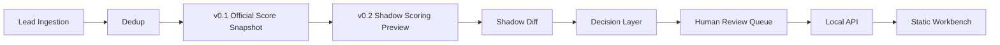

# AI FT-OPC Phase 1.5 + Phase 2 Local Implementation

版本：v0.1
日期：2026-07-02
状态：本地 MVP 已实现，未接生产数据库
适用范围：Lead Ingestion、Dedup、v0.1/v0.2 shadow scoring、本地 Decision、Human Review Queue、API Layer、静态 Workbench
禁止事项：不得执行数据库 migration；不得连接真实 PostgreSQL；不得修改 `public.leads`、`score_lead_v01()`、`leads_score_v01` 或正式评分字段；不得修改 n8n、Docker、服务器；不得自动触达客户。

## 1. 当前定位

Phase 1.5 + Phase 2 是本地产品化链路，用于把已有 Phase 1 内存 MVP 扩展为更接近真实产品工作台的最小可运行闭环。

当前默认配置：

- `APP_STORAGE_MODE=memory`
- `SHADOW_WRITER_ENABLED=false`
- `HTTP_SERVER_ENABLED=false`

本实现不读取 `.env`，不依赖生产连接字符串，不连接真实数据库。

## 2. 本地链路



## 3. 模块职责

### packages/ingestion

负责本地 Lead 输入标准化：公司名、domain、国家猜测、行业简化映射。

### packages/dedup

负责本地去重：同 domain 直接重复，company name 用简单相似度辅助判断。

### packages/decision

保留 Phase 1 决策规则：HOT / WARM / COLD、confidence、reasons、risk_flags、next_step。

### packages/persistence

新增持久化边界：

- Memory adapter：本地 demo/test 默认使用。
- PostgreSQL adapter：仅接口和注入式 client 草案，不自动连接数据库。
- Guard：默认拒绝 shadow/review 写入 PostgreSQL。

### packages/phase2-domain

新增 Phase 2 业务编排：

- 单条 Lead shadow run。
- v0.1 与 v0.2 shadow diff。
- replay inconsistency 风险标记。
- invalid config 阻断。
- review queue item 生成。

### apps/api-server

新增 Phase 2 本地 API handler 与 demo/test。HTTP server 默认不启动，只有显式传入 `enabled: true` 才会监听本地地址。

### apps/workbench

静态 HTML/CSS/JS 工作台原型：

- Lead Inbox。
- Lead Detail。
- Review Queue。
- Approve / Reject / Skip 本地按钮。

页面只调用本地 `/api/*`，不包含外部前端依赖。

## 4. API 边界

当前 API 为本地内存 handler：

- `GET /api/health`
- `GET /api/leads`
- `GET /api/leads/:id`
- `GET /api/leads/:id/shadow-history`
- `POST /api/shadow-runs/single-lead/preview`
- `GET /api/review-queue`
- `GET /api/review-queue/:id`
- `POST /api/review-queue/:id/approve`
- `POST /api/review-queue/:id/reject`
- `POST /api/review-queue/:id/skip`

所有响应包含 `mode: "local_mvp"`。

## 5. 数据安全

本地 snapshot 仅保存结构化脱敏字段：

- `has_email`
- `has_phone`
- `website_summary`
- `v01_score`
- `v01_grade`
- `v01_priority`

不得保存：

- 完整 email。
- 完整 phone。
- `raw_data`。
- HTML。
- headers。
- cookies。
- stack。
- response。
- credentials。
- secrets。

## 6. Migration Draft

本次只创建草案：

- `database/migrations/DRAFT-005-lead-scoring-v0.2-shadow-mode.sql`
- `database/migrations/DRAFT-006-phase2-review-queue.sql`

草案顶部明确：

- `DRAFT ONLY - DO NOT EXECUTE`
- `NOT APPROVED FOR PRODUCTION`
- `MUST NOT MODIFY public.leads OFFICIAL SCORE FIELDS`

未执行 migration。

## 7. 运行方式

```bash
npm run phase1:test
npm run phase2:demo
npm run phase2:test
```

静态 Workbench 需要用户明确批准后，才可通过本地 HTTP server 入口进行人工查看。默认 `phase2-http-server.ts` 不监听端口。

## 8. 验收标准

- Phase 1 测试通过。
- Phase 2 demo 能跑通本地 shadow run、diff、decision、review queue。
- Phase 2 测试通过。
- PostgreSQL adapter 默认拒绝写入。
- HTTP server 默认不启动。
- v0.1 score / grade / priority 不变。
- 不读取 secrets，不连接数据库，不修改 n8n。

## 9. 风险

- 当前仅为内存级 MVP，进程退出后数据丢失。
- PostgreSQL adapter 只有接口与 guard，还未经过真实数据库审查。
- Migration 文件只是草案，未批准、未执行。
- Workbench 是静态原型，不具备登录、权限、审计和生产级安全控制。

## 10. 回滚原则

- 删除或停用 Phase 2 API/demo/test/workbench 入口即可回退本地产品化层。
- 不影响现有 scoring-engine。
- 不影响现有 orchestration。
- 不涉及生产数据回滚，因为本次没有连接或写入生产数据库。

## 11. 下一步入口

进入真实单条 Lead Shadow Run 前，必须先获得用户明确批准：

1. 只读预检真实目标 Lead。
2. 审查并批准正式 migration SQL。
3. 审查 PostgreSQL adapter 的真实 SQL、参数化方式和权限。
4. 明确 shadow writer 开关、执行令牌和回滚策略。
5. 先执行单条 shadow run，不写 `public.leads` 正式评分字段。
